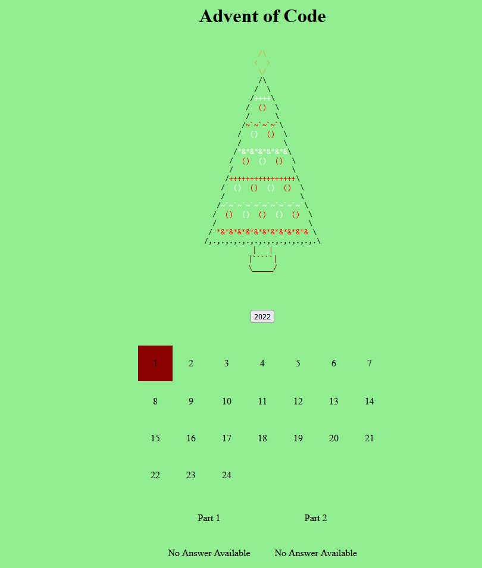

# AoC
[](https://github.com/sventer444/AoC/actions/workflows/master_venteradventofcode.yml)
Repo for my Advent of Code answers

:santa: Merry Christmas, Happy Holidays :christmas_tree:

## Screenshot


### To Run

basic webpage running on a nodejs express server, to run execute
```
npm run start
```
and then navigate to the hosted page (localhost:8080)
